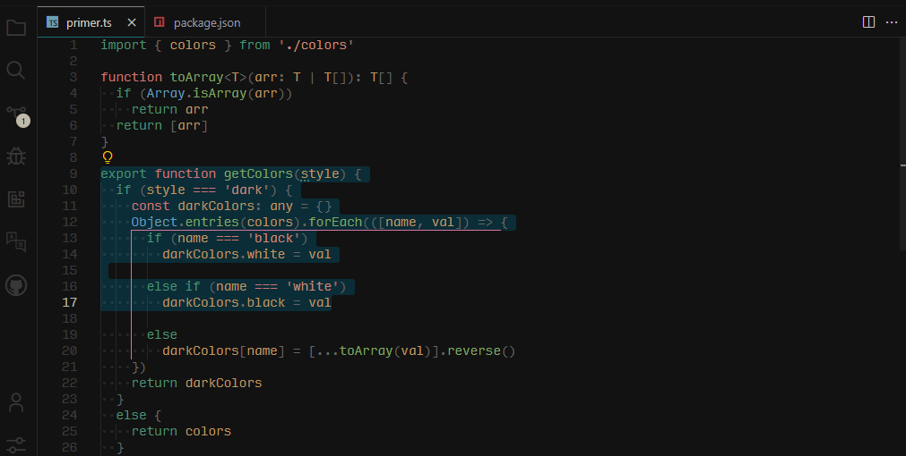

<h1 align="center">Elkon Theme for VS Code</h1>

<p align="center">
<a href="https://marketplace.visualstudio.com/items?itemName=elkon.elkon-vscode-theme" target="__blank"></a>
</p>

<p align="center">


<sub><samp>&nbsp;&nbsp;&nbsp;&nbsp;&nbsp;&nbsp;&nbsp;Font | <a href="http://input.fontbureau.com/">Input Mono</a><br>
&nbsp;File Icons | <a href="https://marketplace.visualstudio.com/items?itemName=file-icons.file-icons">File Icons</a><br>
Product Icons | <a href="https://github.com/antfu/vscode-icons-carbon">Carbon</a>&nbsp;&nbsp;&nbsp;&nbsp;&nbsp;&nbsp;<br>
&nbsp;&nbsp;&nbsp;&nbsp;&nbsp;&nbsp;&nbsp;&nbsp;&nbsp;&nbsp;Demo | <a href="https://github.com/antfu/vitesse">Vitesse</a>&nbsp;&nbsp;&nbsp;&nbsp;&nbsp;&nbsp;</samp></sub>
</p>

## Match with System

<!--eslint-skip-->

```jsonc
// .vscode/setting.json
{
  "window.autoDetectColorScheme": true,
  "workbench.preferredLightColorTheme": "Elkon Light",
  "workbench.preferredDarkColorTheme": "Elkon Dark",
}
```
### Changed of [vitesse-theme](https://github.com/antfu/vscode-theme-vitesse)

```git
src/colors.ts

-  border: ['#191919', '#f0f0f0'],
+  border: ['#272727', '#f0f0f0'],

src/theme.ts
- 'tab.activeBorder': border,
+ 'tab.activeBorder': '#1f7075',

- 'editor.selectionBackground': pick({ light: '#22222210', dark: '#eeeeee10' }),
+ 'editor.selectionBackground': pick({ light: '#22222210', dark: '#01597462' }),

- 'panel.background': background,
+ 'panel.background': '#161616',

- 'terminal.selectionBackground': pick({ light: '#eeeeee', dark: activeBackground }),
+ 'terminal.selectionBackground': pick({ light: '#eeeeee', dark: '#01597462' }),
```


## Links

[prism-theme-vars](https://github.com/antfu/prism-theme-vars) - where the theme born.

[vitesse](https://github.com/antfu/vitesse) - what the theme was for.

## Thanks

This project is based on [vitesse-theme](https://github.com/antfu/vscode-theme-vitesse).

## License

MIT - Copyright (c) 2020 Primer <br>
MIT - Copyright (c) 2021 Anthony Fu <br>
MIT - Copyright (c) 2022 Elkon
